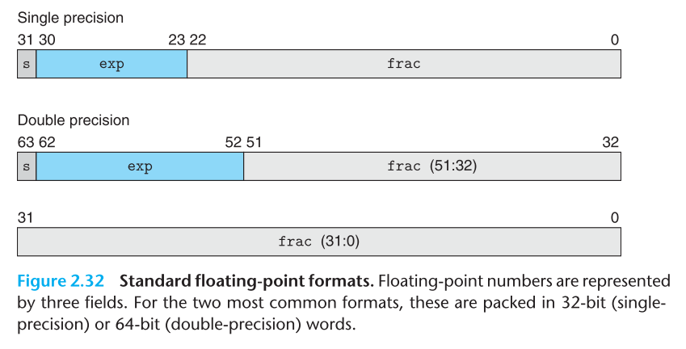
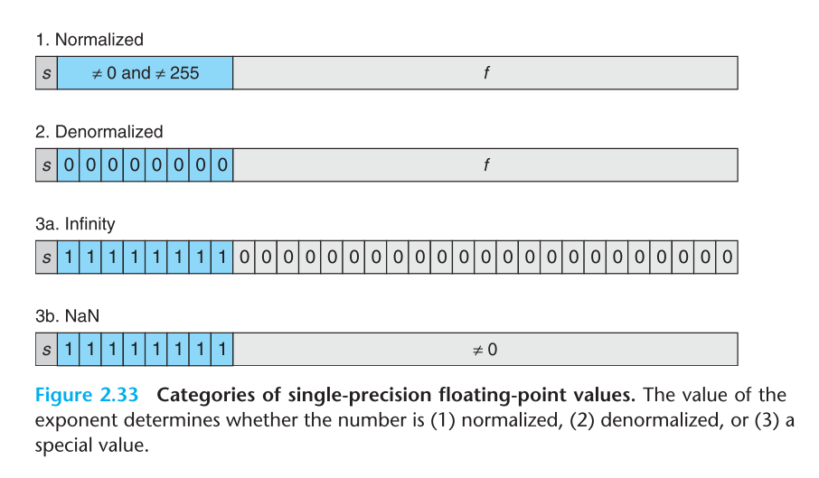

# Table of Contents
* [Information Storage](#information-storage)
  * [Data Sizes](#data-sizes)
  
* [Integer Representation](#integer-representation)
  * [Integer Data Types](#integer-data-types)
  * [Unsigned Integer Encodings](#unsigned-integer-encodings)
  * [Signed Integer Representation](#signed-integer-representation)
  * [Signed vs. Unsigned Numbers](#signed-vs-unsigned-numbers)
    * [Conversions between Signed and Unsigned](#conversions-between-signed-and-unsigned)
    * [Expanding the Bit Representation of a Number](#expanding-the-bit-representation-of-a-number)
    * [Truncating Numbers](#truncating-numbers)
  * [Integer Arithmetic](#integer-arithmetic)
* [Floating Point Representation](#floating-point-representation)
  * [Fractional Binary Numbers](#fractional-binary-numbers)
  * [IEEE Floating-Point Representation](#ieee-floating-point-representation)
  * [Rounding](#rounding)
    * [Task of Rounding Operation](#task-of-rounding-operation)  
    * [Four IEEE Rounding Modes](#four-ieee-rounding-modes)
  * [Insignificant Digits](#insignificant-digits)
  * [Crazy Conversions](#crazy-conversions)
  * [Floating-Point Operations](#floating-point-operations)
    * [Floating-Point Addition](#floating-point-addition)
    * [Floating-Point Multiplication](#floating-point-multiplication)
* [Floating Point in Programming Languages](#floating-point-in-programming-languages)  
  * [Floating Point in C](#floating-point-in-c)
  * [Floating Point in Python](#floating-point-in-python)
  

# Information Storage
* **Bytes**(8-bits): The smallest addressable unit of memory in most computers.

## Data Sizes

### Word Size
* Every computer uses word size to indicate the nominal size of pointer data. A virtual address is encoded by such a word.

### Virtual Address Space
* The most important system parameter determined by the word size is the maximum size of the virtual address space.

### C Language
* The C language allocate different number of bytes for different C data types. 
  * However the exact numbers of bytes for some data types depends on how the program is compiled for(32-bit or 64-bit).
    * Data type `char *` (a pointer) and `long` commonly have 4 bytes in 32-bit programs and 8 bytes in 64-bit programs.
    
### Implications
* Programmers should strive to make their programs portable across different machines and compilers. 
  * Make the program insensitive to the exact sizes of the different data types.
    * Ex1. Programs that enable communications over the Internet need to have data types compatible with the standard protocol.

# Integer Representations
## Integer Data Types

#### Integer Data Types in C
* Variable-Size Data Types
  * Each type can specify a size with keyword `char`, `short`, `int`, `long`, as well as an indication of whether the represented numbers are all nonegative (`unsigned`) or possibly negative (the default). 
  
* Fixed-Size Data Types
  * Their data sizes and range of values are fixed regardless of compiler and machine settings.
  * Example: `int32_t`, `int64_t`
  
#### Integer Data Types in Python
* 

## Unsigned Integer Encodings

* The range of values that can be represented as a `w-bit` vector: [0, 2<sup>w</sup>-1]
* Every number between `0` and 2<sup>w</sup>-1 has a unique encoding as a `w-bit` value

## Signed Integer Representation
### Two's-Complement Encodings
> It's defined by interpreting the most significant bit (i.e. x<sub>w-1</sub>, also called the 'sign bit') of the word to have negative weight.

* The range of values that can be represented as a `w-bit` two’s-complement number: [-2<sup>w-1</sup>, 2<sup>w-1</sup>-1]
  * The range is asymmetric: There's no positive counterpart of the minimum negative value.
  * The maximum unsigned value is just one over twice the maximum two's-complement value. 
* For nonnegative `x`, the `w-bit` representation of `-x` is: 2<sup>w</sup> - x. (???)
* Nearly all machines represent signed integers in two's-complement form.

* Implications
  * The C standards do not require signed integers to be represented in two's-complement form, but nearly all machines do so.
  * The Java standard requires a two's-complement representation with the exact same ranges as in 64-bit case.
    * In Java the single-byte type is called `byte` instead of `char`.


### Alternative Representations of Signed Numbers
* Ones' Complement
* Sign Magnitude

## Signed vs. Unsigned Numbers
### Conversions between Signed and Unsigned

#### C Language
* C allows casting between different numeric data types.
* For most implementations of C, the effects of casting signed value to unsigned (or vice versa) is based on a bit-level perspective, rather than on a numeric one.
  * General rule of most C implementations in handling conversions between signed and unsigned numbers with the same word size: The numeric values might change, but the bit patterns do not.
    * Ex1. 
    ```
    short int v = -12345;
    unsigned short uv = (unsigned short) v; 
    printf("v = %d, uv = %u\n", v, uv);
    # v = -12345, uv = 53191
    ```
  * The maximum value of unsigned integer has the same bit representation as does `-1` in two's-complement form.
* Some possibly nonintuitive behavior arises due to C's handling of expressions containing combinations of signed and unsiged quantities.
  * When either operand of a comparison is unsigned, the other operand is implicitly cast to unsigned. 
  
#### Java Language
  * Java supports only **signed integers**.
  * Java requires that they be implemented with two’s-complement arithmetic. The normal right shift operator >> is guaranteed to perform an arithmetic shift. The special operator >>> is defined to perform a logical right shift.
  * Unsigned values can still be useful when we want to think of words as just collections of bits with no numeric interpretation
    * Packing a word with `flags` describing various Boolean conditions
    * To represent addresses
    * To implement mathematical packages for modular arithmetic
    * To implement multiprecision arithmetic in which numbers are represented by arrays of words.
#### Python Language    
  * Python has no unsigned integer data type.
    
### Expanding the Bit Representation of a Number
* Zero Extension: To convert an **unsigned number** to a larger data type, we can add leading zeros to the representation.
* Sign Extension: To convert a **two's-complement number** to a larger data type, adding copies of the most significant bit to the representation. 

### Truncating Numbers
* Truncating a number can alter its value --- a form of overflow.

## Integer Arithmetic

### Unsigned Addition
* **Word Size Inflation**: We cannot place any bound on the word size required to fully represent the results of arithmetic operations (e.g. when we add two unsigned numbers, we need larger word size to accomodate the sum).
  * **Lisp** language actually support `arbitrary size` arithmetic to allow integers of any size
  
* Most programming languages suppose `fixed-size` arithmetic, hen operations ssuch as "addition" and "multiplication" differ from their counterpart operations over integers.

* Unsigned Addition
> Unsigned Addition: for two unsigned integers `x` and `y` with `w` bits, truncate the integer sum `x+y` to be `w` bits long and then viewing the result as an unsigned number.

> Overflow: An arithmetic operation is said to `overflow` when the full integer result cannot fit within the word size limits of the data type.

  * It can be characterized as a form of **modular arithmetic**: computing the sum modulo 2<sup>w</sup> by simply discarding any bits with weight greater than 2<sup>w-1</sup> in the bit-level representation of `x+y`.
  * The addition **overflow**s when the sum is greater than or equal to 2<sup>w</sup>
  * Modular addition forms a mathematical structure known as an `abelian group`. 
    * It is commutative (`abelian`)
    * It is associative
    * It has an identity element 0
    * Every element has an additive inverse
  (N.B. Both unsigned and two's-complement integer addition form an abelian group.)
  (N.B. Both unsigned and two's-complement arithmetic satisfy distributivity)
  * Satisfying the `abelian` properties allows compilers to do many optimizations.
    * `7*x` can be replaced by `(x<<3)-x` using associative, commutative, and distributive properties.
  
### Two’s-Complement Addition
* We avoid ever-expanding data sizes by truncating the representation to w bits. The result is not a modular addition.
* There are positive overflow and negative overflow.
* The `w-bit` two’s-complement sum of two numbers has the exact same bit-level representation as the unsigned sum. In fact, most computers use the same machine instruction to perform either unsigned or signed addition.
  
### Two’s-Complement Negation
* For `w-bit` two’s-complement addition, TMin<sub>w</sub> (The minimum value with `w-bit` two's-complete representation) is its own additive inverse, while any other value `x` has `−x` as its additive inverse.
* Two techniques to determine two's-complement negation
  * Complement the bits and then increment the result.
  ```
  -x = ~x + 1 # in C
  ```
    * Example: The complement of `0xf` is `0x0` and the complement of `0xa` is `0x5`, so `0xfffffffa` is the two's-complement representation of `-6`.
  * Split the bit vector into two parts. Let `k` be the position of the rightmost `1`, we then complement each bit to the left of bit position `k` to get the negation.

### Unsigned Multiplication
* Unsigned multiplication in C is defined to yield the `w-bit` value given by the low-order `w` bits of thw `2w-bit` integer product. This is equivalent to computing the product value modulo 2<sup>w</sup>. 

### Two’s-Complement Multiplication
* Signed multiplication in C generally is performed by truncating the `2w-bit` product to `w` bits. This is equivalent to first computing its value modulo 2<sup>w</sup> and then converting from unsigned to two's complement. 

* The bit-level representation of the product operation is identical for both unsigned and two's-complement multiplication. 

### Multiplying by Constants
* Integer multiply instruction on many machines require more clock cycles than other integer operations (e.g. addition, subtraction, bit-level operations, shifting only require 1 clock cycle). 
* Compilers thus provide an important optimization: They attempt to replace multiplications by constant factors with combinations of shit and addition operations. 
* Given that integer multiplication is more costly than shifting and adding, many C compilers try to remove many cases where an integer is being multiplied by a constant with combinations of shifting, adding, and subtracting. 

#### Multiplication by a power of 2
* Unsigned multiplication by a power of 2 is equivalent to shift the value left.
  * For C variables `x` and `k` with unsigned values `x` and `k`, such that `0<=k<w`, the C expression `x<<k` yields the value `x*2^k`.
* Two's-complement multiplication by a power of 2
  * For C variables `x` and `k` with tow's-complement value `x` and unsigned value `k`, such that `0<=k<w`, the C expression `x<<k` yields the value `x*2^k`. 
  * This is because the bit-level operation of fixed-size two's-complement arithmetic is equivalent to that for unsigned arithmetic.
* Multiplying by a power of 2 can cause overflow with either unsigned or two's-complement arithmetic. Even then, we get the same effect by shifting. 

### Dividing by Powers of 2

* Integer division on most machines is even slower than multiplication, requiring 30 or more clock cycles. 
* Integer division convention always **rounds toward zero**. That is, it should round down a positive result but round up a negative one. For example, `8/3=2`. 

##### Two Right Shifts
* Logical Right Shift: It has the same effect as dividing by 2<sup>k</sup> and then rounding toward zero.
* Arithmetic Right Shift:  It is similar to division by a power of 2, except that it rounds down rather than toward zero.
  
##### Unsigned integers

* Right shifting is guaranteed to be performed **logically** for unsigned values.
* The result of shifting unsigned integers consistently rounds toward zero, as is the convention for integer division. 
* For C variables `x` and `k` with unsigned values `x` and `k`, such that `0<=k<w`, the C expression `x>>k` yields the value `floor(x/2^k)`.
  
##### Two's-complement multiplication by a power of 2
* First, the shifting should be performed using an **arithmetic right shift**, to ensure that negative values remain negative (i.e. adding 1 to the left during shift).
* Two’s-complement division by a power of 2, rounding down.
  * Let C variables `x` and `k` have two’s-complement value `x` and unsigned value `k` respectively, such that `0<=k<w`. The C expression `x>>k`, when the shift is performed arithmetically, yields the value `floor(x/2^k)`.
  * For `x>=0`, variable `x` has 0 as the most significant bit, and so the effect of an **arithmetic shift** is the same as for a **logical right shift**. Thus, an arithmetic right shift by `k` is the same as division by 2<sup>k</sup> for a nonnegative number. 
  
* We can correct the improper rounding that occurs when a negative number is shifted right by "biasing" the value before shifting.    
  * Let C variables `x` and `k` have two's-complement value `x` and unsigned value `k`, respectively, such that `0<=k<w`. The C expression `(x+(1<<k)-1)>>k`, when the shift is performed arithmetically, yields the value `ceiling(x/2^k)`.
* Compute the value `x/2^k` in C:
```
(x<0 ? x + (1<<k)-1 : x) >> k
```

# Floating Point Representation
> A floating-point representation encodes rational numbers of the form V = x×2<sup>y</sup>. It's useful as an approximation to real arithmetic.
* Virtually all computers support **IEEE floating point** and most machines encode floating-point numbers using IEEE Standard 754.

* Representation error: It refers to the fact that some (most, actually) decimal fractions cannot be represented exactly as binary (base 2) fractions. 
  * This is the chief reason why Python (or Perl, C, C++, Java, Fortran, and many others) often won’t display the exact decimal number you expect.
  * Example: No matter how many base 2 digits you’re willing to use, the decimal value 0.1 cannot be represented exactly as a base 2 fraction.
  * The computer strives to convert 0.1 to the closest fraction it can of the form `J/(2**N)` where J is an integer containing exactly 53 bits. See [Python Doc: Floating Point Arithmetic: Issues and Limitations](https://docs.python.org/3/tutorial/floatingpoint.html)

## Floating Point vs. Fixed Point Representations
* A fixed-point representation of a number may be thought to consist of 3 parts: the sign field, integer field, and fractional field.
* Consider the normalized representation of `x`: ±(1.b<sub>1</sub>b<sub>2</sub>b<sub>3</sub>...)<sub>2</sub> × 2<sup>n</sup>. The normalized representation is achieved by choosing the exponent `n` so that the binary point **floats** to the position after the first nonzero digit. This is the binary version of scientific notation.
* Check [Fixed-point and floating-point representations of numbers](http://www.math.drexel.edu/~tolya/300_float.pdf) 
 
## Fractional Binary Numbers
* Binary numbers of the form `0.11 ... 1` represent numbers just below 1. For example, `0.111111` represents `63/64`. We will use the shorthand notation `1.0 − ε`.

## IEEE Floating-Point Representation
* We would like to represent numbers in a form x×2<sup>y</sup> by giving the values of `x` and `y`. 
* The IEEE floating-point standard represents a number in a form V = (-1)<sup>s</sup>×M×2<sup>E</sup>. 
  * The **sign s** determines whether the number is positive or negative, where the interpretation of the sign bit for numeric value 0 is ahndled as a special case. Encoded by the single sign bit **s** field. 
  * The **significand M** is a fractional binary number that ranges either between 1 and `2-ε` or between 0 and `1-ε`. Encoded by the `n-bit` **frac** field. 
  * The **exponent E** weights the value by a (possibly negative) power of 2. Encoded by the `k-bit` **exp** field.

* Standard floating-point formats

(cited from "Computer Systems: A Programmer‘s Perspective" by R. Bryant, D. Hallaron, 2003)

* Floating-point values can both overflow when they exceed the range of the representation or underflow when they are so close to 0.0 that they are changed to zero. 

### Single Precision vs. Double Precision
* The precision of a floating-point format is the number of positions reserved for binary digits plus one (for the hidden bit).
* Single-precision floating-point format
  * s = 1, k = 8, n = 23
  * precision is 23 + 1 = 24
  * The 24 bits (including the hidden bit) of mantissa in a 32-bit floating-point number represent approximately 7 significant decimal digits.
  * A `float` in C
* Double-precision floating-point format
  * s = 1, k = 11, n = 52
  * precision is 52 + 1 = 53
  * The 53 bits (including the hidden bit) of mantissa in a 64-bit floating-point number represent approximately 16 significant decimal digits.
  * A `double` in C
  * A `float` in Python
    * Almost all platforms map Python `floats` to IEEE-754 “double precision”. 754 doubles contain 53 bits of precision  (52 explicitly stored).

### Categories of the Values Encoded by a Given Bit Representation


##### Normalized Values
* It occurs when the bit pattern of **exp** is neither all zeros (numeric value 0) nor all ones (numeric value 255 for single precision, 2047 for double).
 
* The exponent field is interpreted as representing a signed integer in **biased** form. 
  * That is, the exponent value is `E = e - Bias`, where `e` is the unsigned number having bit representation e<sub>k-1</sub>...e<sub>1</sub>e<sub>0</sub> and *Bias* is a bias value equal to 2<sup>k-1</sup> - 1 (127 for single precision, 1023 for double). 
  * This yields exponent ranges from -126 to +127 for single precision and -1022 to +1023 for double precision.
  * The bias is to make smooth transition from denormalized to normalized values.
* The fraction field **frac** is intepreted as representing the fractional value *f*, where 0&le;f<1, having binary representation 0.f<sub>n-1</sub>...f<sub>1</sub>f<sub>0</sub>, that is, with the binary point to the left of the most significant bit. 
  * The significand is defined to be `M = 1 + f`.
  * This is called an *implied leading 1* representation.
  * This is a trick to get an additional bit of precision for free, since we cal always adjust the exponent E so that significand M is in the range 1&le;M<2.

##### Denormalized Values
* The exponent field is all zeros.
  * The exponent value is `E = 1 - Bias`.
  * The significand value is `M = f`.
  
* The floating-point representation of +0.0 has a bit patten of all zeros: the sign bit is 0, the exponent field is all zero, and the fraction field is all zeros. 
* When the sign bit is 1, but the other fields are all zeros, we get the value -0.0. 

* Purposes of Denormalized Values
  * To provide a way to represent numeric value 0, since with a normalized number we must always have M&ge;1.
  * To represent numbers that are very close to 0.0. 
    * They provide a property known as *gradual underflow* in which possible numeric values are spaced evenly near 0.0.

##### Special Values
* The exponent field is all ones. 
  * When the fraction field is all zeros, the value is either +∞ or -∞ depending on the sign bit. 
    * Infinity can represent results that overflow
  * When the fraction field is nonzero the resulting value is a *NaN*.   

### General Properties for a Floating-Point Representation with a k-bit exponent and an n-bit fraction
* The value +0.0 always has a bit representation of all zeros.
* The value 1.0 has a bit representation with all but the most significant bit of the exponent field equal to 1 and all other bits equal to 0. Its significand value is M = 1 and its exponent value is E = 0.
* The spacing between the floating-point numbers is not uniform, but varies from one dyadic interval [2<sup>n</sup>, 2<sup>n+1</sup>) to another. They are denser nearer the origin.

* The IEEE format was designed so that floating-point numbers could be sorted using an integer sorting routine.
  * If we interpret the bit representations of the nonnegative floating-point numbers as unsigned integers they occur in ascending order, as do the values they represent as floating-point numbers. 
  * A minor difficulty occurs when dealing with negative numbers, since they have a leading 1 and occur in descending order, but this can be overcome without requiring floating-point operations to perform comparisons. 
* Because the same number of bits are used to represent all normalized numbers, [the smaller the exponent, the greater the density of representable numbers](http://www.lahey.com/float.htm). For example, there are approximately 8,388,607 single-precision numbers between 1.0 and 2.0, while there are only about 8191 between 1023.0 and 1024.0.

### Machine Epsilon
* The gap between `1` and the next normalized floating-point number is known as machine epsilon. 
  * For 32-bit single precision floating numbers, this gap is (1 + 2<sup>−23</sup>) − 1 = 2<sup>−23</sup>. Note that this is not the same as the smallest positive floating-point number.
  
### [Insignificant Digits](http://www.lahey.com/float.htm)
* Meaningless digits could seem to be significant
```  
#include <stdio.h>
int main()
{
    float a = 1000.2;
    float b = 1000.0;
    float c = a - b;
    printf ("%f", c);
    return 0;
}
```

* A single-precision entity can represent a maximum of about 7 decimal digits of precision, so the subtraction above represents (1000.200 - 1000.000). The result, therefore, can only represent about 3 decimal digits. The program, however, will happily print out "0.200012". Because 1000.2 is not exactly representable in binary floating-point and 1000.0 is, the result `c` is a little larger than 0.2. The computer doesn't know that the digits beyond ".200" have no meaning.
* If you stay aware of the number of decimal digits represented by a data type, approximating the number of significant digits is a straight-forward, but perhaps time-consuming, task. Give the most attention to:
  * subtractions of numbers that are nearly equal, 
  * additions of numbers whose magnitudes are nearly equal, but whose signs are opposite, and 
  * additions and subtractions of numbers that differ greatly in magnitude.

### [Crazy Conversions]
* Conversions to integer can unmask inaccuracies in a floating-point number. 
* The closest single-precision floating-point number to 21.33 is slightly less than 21.33, so when it is multiplied by 100., the result `Y` is slightly less than 2133.0. If you print `Y` in a typical floating-point format, rounding causes it to be displayed as 2133.00. However, if you assign `Y` to an integer `I`, no rounding is done, and the number is truncated to 2132.
```
REAL X, Y
INTEGER I
X = 21.33       ! Slightly less than 21.33
Y = X * 100.    ! Slightly less than 2133.0
I = Y           ! Truncates to 2132
PRINT *, Y, I   ! Prints "2133.00      2132"
END
```

The following program prints "1.66661000251770" when compiled with Lahey's LF90:
DOUBLE PRECISION D
REAL X
X = 1.66661     ! Assign to single precision
D = X           ! Convert to double precision
PRINT *, D
END
You ask, "Why do you extend the single-precision number with the seemingly random '000251770'?" Well, the number isn't extended with random values; the computer's floating-point does the conversion by padding with zeros in the binary representation. So D is exactly equal to X, but when it is printed out to 15 decimal digits, the inexactness shows up. This is also another example of insignificant digits. Remember that assigning a single-precision number to a double-precision number doesn't increase the number of significant digits.

  
### Rounding
#### Task of Rounding Operation
* Floating-point arithmetic can only approximate real arithmetic, since the representation has limited range and precision. Thus, for a value `x`, we generally want a systematic method of finding the “closest” matching value `x'` that can be represented in the desired floating-point format. This is the task of the rounding operation
* One key problem is to define the direction to round a value that is halfway between two possibilities. 
* An alternative approach is to maintain a lower and an upper bound on the actual number. For example, we could determine representable values `x−` and `x+` such that the value `x` is guaranteed to lie between them: `x-<=x<=x+`.

#### Four IEEE Rounding Modes
* Round to Even (Round to Nearest)
  * This is the default method. It finds a closet match, while the other three produce guaranteed bounds on the actual value.
  * Round-to-even mode adopts the convention that it rounds the number either upward or downward such that the least significant digit of the result is even.
  * Rounding toward even numbers avoids statistical bias (if we just rounding down or up) in most real-life situations. It will round upward about 50% of the time and round downward about 50% of the time.
* Round Twoard Zero
* Round Down
* Round Up

### Floating-Point Operations

* IEEE Rule: viewing floating-point values `x` and `y` as real numbers, and some operation `op` defined over real numbers, the computation should yield `Round(x op y)`, the result of applying rounding to the exact result of the real operation. 
  * This is independent of any particular hardware or software realization.

#### Floating-Point Addition
* Addition over real numbers also forms an abelian group, but we must consider what effect rounding has on these properties.
* Abelian Group Properties for floating-point addition: `Round(x+y)`
* It's commutative for all values of `x` and `y`
* Most values have inverse under floating-point addition. Except infinities and `NaN`s.
  * `+∞ - ∞ = NaN`
  * `NaN + x = NaN` for any `x`
* It's not associative. 
  * `(3.14+1e10)-1e10=0.0` while `3.14 + (1e10-1e10) = 3.14` (assuming single-precision floating point representation). In former calculation `3.14` is lost due to rounding. 
  * This has important implications for scientific programmers and compiler writers.
* It satisfies the following monotonicity property: If a&ge;b, then `Round(x+a)` &ge; `Round(y+b)` for any values of `a`, `b`, and `x` other than `NaN`. 
  * This property of real (and integer) addition is not obeyed by unsigned or two's-complement addition. 

#### Floating-Point Multiplication
* Let's consider the floating-point multiplication: `Round(x×y)`.
* This operation is closed under multiplication (although possibly yielding infinity or Nan).
* It is commutative
* It has 1.0 as a multiplicative identity
* It is not associative due to the possibility of overflow or the loss of precision due to rounding. 
  * For single-precision floating point, `(1e20*1e20)*1e-20 = +∞` while `1e20*(1e20*1e-20)= 1e20`
* It does not distribute over addition.
  * `1e20*(1e20-1e20) = 0.0` while `1e20*1e20 - 1e20*1e20 = NaN`
* It satisfies monotonicity property for any values of `a`, `b`, and `c` other than `NaN`:
  *  a &ge; b and c &ge; 0 ==> Round(a×c) &ge; Round(b×c)
  *  a &ge; b and c &le; 0 ==> Round(a×c) &le; Round(b×c)
  * We also guaranteed that `Round(a×a)` &ge; `0` as long as `a!= NaN`
  * None of these properties hold for unsigned or two's-complement multiplication.

# Floating Point in Programming Languages

## Floating Point in C
* On machines that suport IEEE floating point:
  * `float` and `double` correspond to single- and double-precision floating point. 
  * The machines use the `round-to-even` rounding mode.
* However C standards do not require the machine to use IEEE floating point
  * No standard methods to change the rounding mode
  * No standard methods to get special values such as: `-0`, `+∞`, `-∞` or `NaN`

### Casting Values
* When casting values between *int*, *float*, and *double* formats, the program changes the numeric values and the bit representations by following certains rules.
  * From *float* or *double* to *int*
    * The value will be rounded toward zero.
    * The value may overflow. Any conversion from floating point to integer that cannot assign a reasonable integer approximation yields *integer indefinite value*, i.e. the bit pattern [10 ... 00]. Thus, the expression `(int) +1e10` yields `-21483648`, generating a negative value from a positive one.
    
## Floating Point in Python
* Python only prints a decimal approximation to the true decimal value of the binary approximation stored by the machine.
* There are many different decimal numbers that share the same nearest approximate binary fraction. 
  * For example, the numbers `0.1` and `0.10000000000000001` and `0.1000000000000000055511151231257827021181583404541015625` are all approximated by `3602879701896397 / 2 ** 55`. 
  * Since all of these decimal values share the same approximation, any one of them could be displayed while still preserving the invariant `eval(repr(x)) == x`.
  * Historically, the Python prompt and built-in `repr()` function would choose the one with 17 significant digits, `0.10000000000000001`. Starting with Python 3.1, Python (on most systems) is now able to choose the shortest of these and simply display `0.1`.
* For use cases which require exact decimal representation, try using the `decimal` module which implements decimal arithmetic suitable for accounting applications and high-precision applications.
* Another form of exact arithmetic is supported by the fractions module which implements arithmetic based on rational numbers (so the numbers like 1/3 can be represented exactly).

### To Losslessly Recreate the Original Value
* The `float.as_integer_ratio()` method expresses the value of a float as a fraction
```
>>> x = 3.14159
>>> x.as_integer_ratio()
(3537115888337719, 1125899906842624)
>>> x == 3537115888337719 / 1125899906842624
True
```

* The `float.hex()` method expresses a `float` in hexadecimal (base 16), again giving the exact value stored by your computer:
```
>>> x.hex()
'0x1.921f9f01b866ep+1'
# This precise hexadecimal representation can be used to reconstruct the float value exactly:
>>>
>>> x == float.fromhex('0x1.921f9f01b866ep+1')
True
```

* Since the representation is exact, it is useful for reliably porting values across different versions of Python (platform independence) and exchanging data with other languages that support the same format (such as Java and C99).

* Another helpful tool is the math.fsum() function which helps mitigate loss-of-precision during summation. 
* It tracks “lost digits” as values are added onto a running total. That can make a difference in overall accuracy so that the errors do not accumulate to the point where they affect the final total:
```
>>> sum([0.1] * 10) == 1.0
False
>>> math.fsum([0.1] * 10) == 1.0
True
```


  


  


